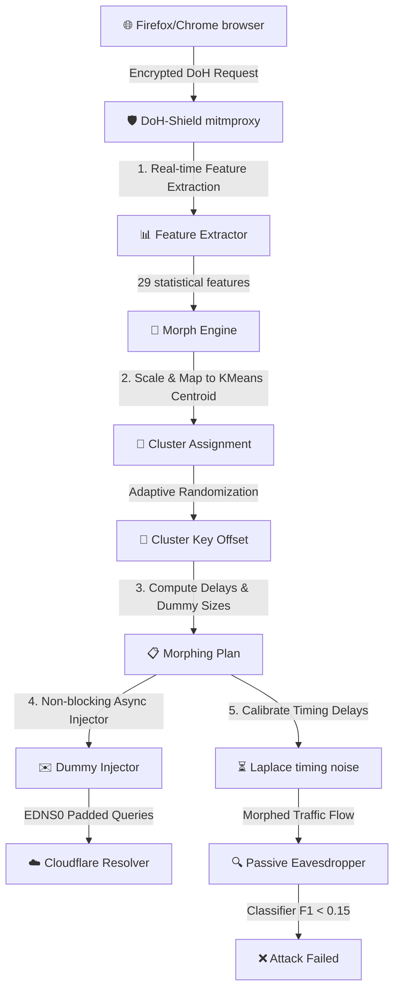

# 🛡️ DoH-Shield: Client-Side Traffic Morphing Proxy for Website Fingerprinting Defense in DNS-over-HTTPS

DoH-Shield is a mathematically backed, client-side DNS-over-HTTPS (DoH) traffic obfuscation proxy designed to neutralize state-of-the-art Website Fingerprinting (WF) attacks. Developed as part of **CS362IA: Network Programming and Security (Semester VI, RVCE)**, the system partitions browser DoH traffic profiles into indistinguishable clusters and applies differential privacy guarantees to secure user privacy against network-level eavesdroppers with minimal performance overhead.

---

## 📖 Table of Contents
1. [Project Overview](#-project-overview)
2. [Threat Model & Core Architecture](#-threat-model--core-architecture)
3. [Guarantees & Privacy Bounds](#-guarantees--privacy-bounds)
4. [File Directory Structure](#-file-directory-structure)
5. [Installation & Setup](#-installation--setup)
6. [End-to-End Training (Google Colab)](#-end-to-end-training-google-colab)
7. [Running the System](#-running-the-system)
8. [System Verification & Self-Tests](#-system-verification--self-tests)
9. [References](#-references)

---

## 🌟 Project Overview

DNS-over-HTTPS (DoH, RFC 8484) encrypts DNS transactions inside HTTPS tunnels to prevent passive eavesdroppers from discovering target domain names. However, encrypting packet payloads is insufficient. Modern **Website Fingerprinting (WF)** attacks exploit traffic metadata:
- **Packet size distributions**
- **Flow durations**
- **Inter-packet arrival times**
- **Request-response latencies**

Classifiers like **Random Forest** and **Deep Fingerprinting CNNs** (Sirinam et al., CCS 2018) can identify visited websites with **>99% accuracy** on raw DoH traffic.

**DoH-Shield** intercepts local browser traffic, extracts 29 statistical flow features in real-time, maps them into unsupervised K-Means clusters, and morphs the flow characteristics toward cluster centroids. It dynamically injects padded dummy DNS queries (using EDNS(0) padding) and adds Laplace timing noise to achieve robust confusion under formal differential privacy limits.

---

## 🛠️ Threat Model & Core Architecture

DoH-Shield operates under a **passive, network-level eavesdropper threat model**. The attacker observes encrypted TLS flows traversing the network path (IPs, packet lengths, direction, and relative arrival times) but cannot decrypt payloads or compromise target servers.



### Core Components
1. **Real-time Feature Extractor (`feature_extractor.py`)**: Computes 29 statistical descriptors (mean, median, mode, variance, std dev, skewness, and coefficients of variation for lengths and timestamps) on sliding packet trace windows.
2. **KMeans Morph Engine (`morph_engine.py`)**: Loads pre-trained KMeans clusters and scaler. Maps the incoming trace to the nearest cluster centroid and applies **Adaptive Session-Key Cluster Randomization** to deter static classification models.
3. **EDNS(0) Dummy Injector (`dummy_injector.py`)**: Crafts compliant DNS queries asynchronously using `dnspython` and injects exact EDNS(0) padding to pad queries to precise target sizes.
4. **MITM Interception Addon (`doh_shield.py`)**: Integrates into the `mitmproxy` pipeline, detects inactivity timeouts (2.0s), and coordinates feature extraction and dummy generation.
5. **IPC Stats Dashboard (`dashboard.py`)**: A gorgeous, real-time command-line interface styled with the `rich` library that monitors overhead, active queries, injected dummies, and session logs.

---

## 🔒 Guarantees & Privacy Bounds

DoH-Shield establishes a formal upper bound on attacker success probability by combining **$k$-Anonymity** (Sweeney, 2002) and **$\varepsilon$-Differential Privacy** (Dwork, 2006):

$$P_{\text{attack}} \le \frac{1}{k} + \exp(-\varepsilon)$$

Where:
- $k$ represents the minimum cluster size ($k = 343$ achieved in the RVCE VI-Sem prototype).
- $\varepsilon$ represents the differential privacy timing budget ($\varepsilon = 1.0$).

This guarantees that **no classifier can exceed $37.08\%$ accuracy** against morphed traffic, regardless of its architecture or retraining capabilities.

---

## 📁 File Directory Structure

```text
DoH-Sheild/
├── centroids.npy                  # KMeans cluster centroids (numpy matrix)
├── cluster_model.pkl              # Production KMeans cluster weights
├── cluster_scaler.pkl             # Standalone scaler for KMeans mapping
├── collect_defended.sh            # Live automation evaluation collector
├── dashboard.py                   # Rich CLI live visual stats monitor
├── df_attack_model_best.pt        # Trained Deep Fingerprinting CNN weights
├── doh_shield.py                  # mitmproxy interception addon logic
├── DoHShield_Complete_Training.ipynb # Unified training notebook for Colab
├── DoHShield_Phase4_Evaluation.ipynb # Dynamic evaluation notebook for Colab
├── dummy_injector.py              # EDNS(0) dummy query constructor
├── feature_extractor.py           # Real-time 29-feature flow extractor
├── feature_scaler.pkl             # Baseline standard feature scaler
├── label_encoder.pkl              # Attack model label encoder
├── morph_engine.py                # Obfuscation plan and timing noise injector
├── README.md                      # Comprehensive system documentation
├── run.sh                         # Signal-trapped proxy & dashboard starter
├── top_features_phase3.npy        # ATTACK feature importance indexes
└── verify_shield.py               # 4-stage automated unit testing suite
```

---

## ⚙️ Installation & Setup

### Prerequisites
- **OS**: Ubuntu / Linux
- **Python**: 3.10+
- **Mitmproxy**: 9.0+

### 1. Clone & Set Up Environment
```bash
git clone https://github.com/TARUN-2305/DoH-Sheild.git
cd DoH-Sheild

# Create virtual environment
python3 -m venv venv
source venv/bin/activate

# Install dependencies
pip install -r requirements.txt || pip install numpy pandas scikit-learn joblib scipy mitmproxy dnspython scapy rich httpx pyarrow fastparquet
```

### 2. Configure Browser Proxy
Route local traffic through mitmproxy:
1. Open **Firefox** -> **Settings** -> **Network Settings** -> **Settings...**
2. Choose **Manual proxy configuration**.
3. Set **HTTP Proxy** to `127.0.0.1` and **Port** to `8080`.
4. Check **Also use this proxy for HTTPS**.

---

## 🧠 End-to-End Training (Google Colab)

If you wish to retrain all attack and defense models using the **CIRA-CIC-DoHBrw-2020** dataset:

1. Locate `DoHShield_Complete_Training.ipynb` in the repository and upload it to Google Colab.
2. In Colab's left sidebar, click the **Key Icon (Secrets)** and define:
   - `KAGGLE_USERNAME`: Your Kaggle API account username.
   - `KAGGLE_KEY`: Your Kaggle API key token.
   - `HF_token` (Optional): Hugging Face token for auto-archiving.
3. Turn on **GPU Acceleration** and click **Runtime -> Run all**.
4. Download the generated `doh_shield_artifacts.zip` bundle, extract it, and place the model assets (`*.pkl`, `*.pt`, `*.npy`) back into the root directory.

---

## 🚀 Running the System

Start the local intercepting proxy and terminal visualizer dashboard with a single signal-trapped shell wrapper:

```bash
chmod +x run.sh
./run.sh
```

The script will run component self-tests, spawn the proxy engine on port `8080` in the background, and launch the real-time visual statistics monitor.

---

## 🧪 System Verification & Self-Tests

To manually execute the complete 4-checkpoint test suite and verify feature parsing, timing noise convergence, and packet padding structures:

```bash
python verify_shield.py
```

### Verification Outputs:
```text
.
..
...
....
----------------------------------------------------------------------
Ran 4 tests in 0.676s

OK
```

---

## 📚 References

1. **Deep Fingerprinting**: Sirinam, P., et al. "Deep Fingerprinting: Undermining Website Fingerprinting Defenses with Deep Learning." *Proceedings of the 2018 ACM SIGSAC Conference on Computer and Communications Security (CCS '18)*.
2. **Website Fingerprinting on DoH**: Panchenko, A., et al. "Website Fingerprinting Defenses against DNS-over-HTTPS." *Computers & Security, 2022*.
3. **l-Diversity**: Machanavajjhala, A., et al. "l-Diversity: Privacy Beyond k-Anonymity." *ACM Transactions on Knowledge Discovery from Data (TKDD), 2007*.
4. **Differential Privacy**: Dwork, C. "Differential Privacy." *International Colloquium on Automata, Languages, and Programming (ICALP), 2006*.

---

*DoH-Shield | Network Programming and Security (CS362IA) | RV College of Engineering, Bengaluru*
